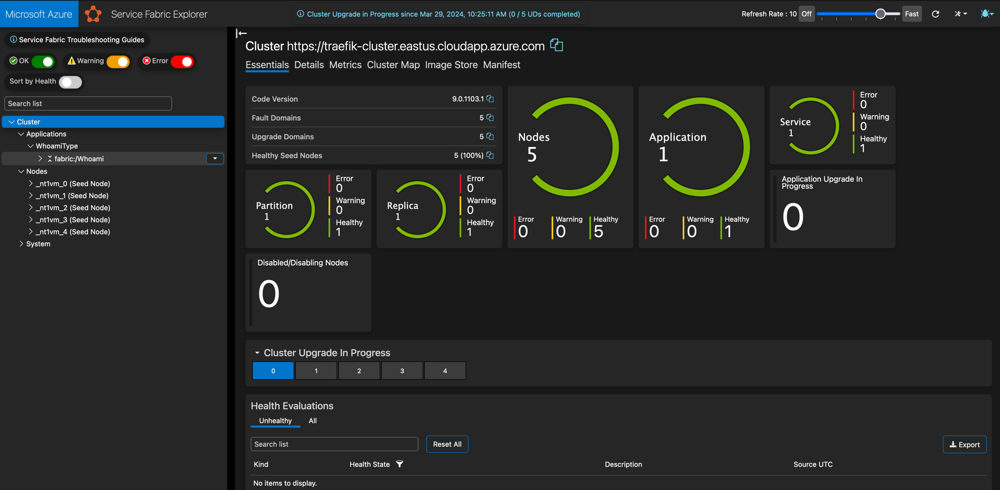
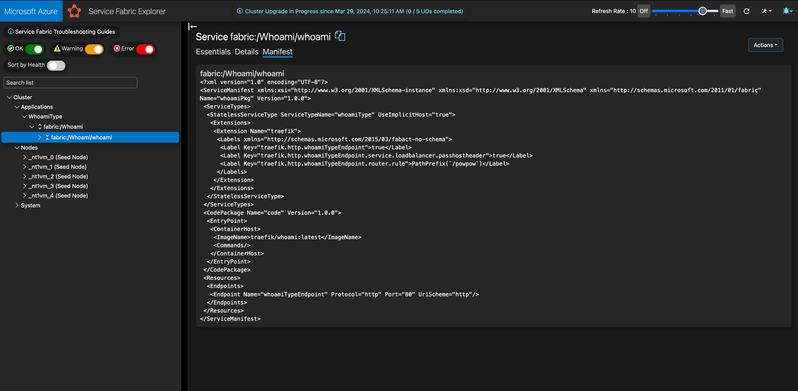
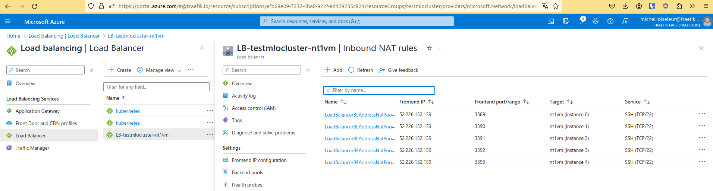

# Traefik inside Service Fabric on Linux

This example shows how to run Traefik Proxy inside Service Fabric, to expose and manage traffic of Service Fabric applications.

## Pre-requisites

You'll need:

1. sfctl, see [here](https://learn.microsoft.com/en-us/azure/service-fabric/service-fabric-get-started-linux?tabs=sdksetupubuntu%2Clocalclusteroneboxcontainer#script-installation)
2. golang 1.22, see [here](https://go.dev/doc/install)

/!\ Do not install latest version of sfctl /!\

```shell
pipx install sfctl==10.0.0
```

## Deploy Service Fabric and virtual machine

You'll need to get your Subscription ID, see [here](https://portal.azure.com/#view/Microsoft_Azure_Billing/SubscriptionsBladeV2) and select a strong password.

```shell
export AZURE_SUBSCRIPTION="XXX"
export SF_PASSWORD="XXX"
./deploy-sf.sh
```

## Connect sfctl

```shell
sfctl cluster select --no-verify --pem traefik-clustereastuscloudappazurecom.pem --endpoint https://traefik-cluster.eastus.cloudapp.azure.com:19080
```

## Deploy Applications

```shell
./deploy-whoami.sh
```





## Deploy Traefik

This shell script will download the traefik v2.11.0 version and build the microsoft fetcher and deploy an application with traefik and fetcher.

```shell
./deploy-traefik.sh
```

## Access to VMs



You can access to VMs with ssh using NAT inbound rules.

In this example:

```shell
ssh traefik@52.226.132.159 -p 3389
```

## Access to dashboard

On http, using cluster name at the start of the url, like in this example: http://traefik-cluster.eastus.cloudapp.azure.com/dashboard/

## Clean

```shell
clean-whoami.sh
clean-traefik.sh
clean-sf.sh
```

## Links

* [Official linux tutorial](https://learn.microsoft.com/en-us/azure/service-fabric/service-fabric-quickstart-containers-linux)
